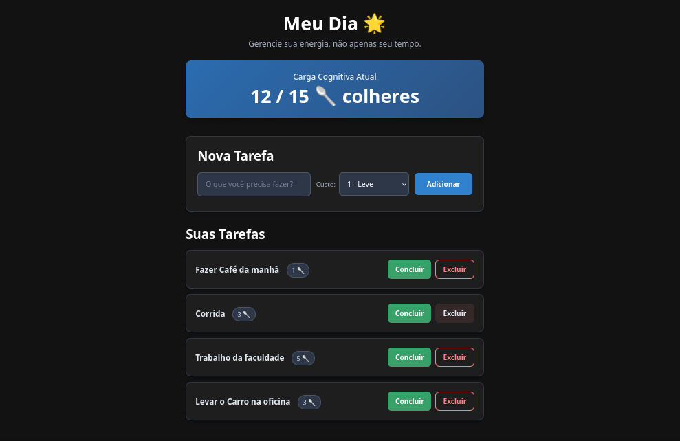
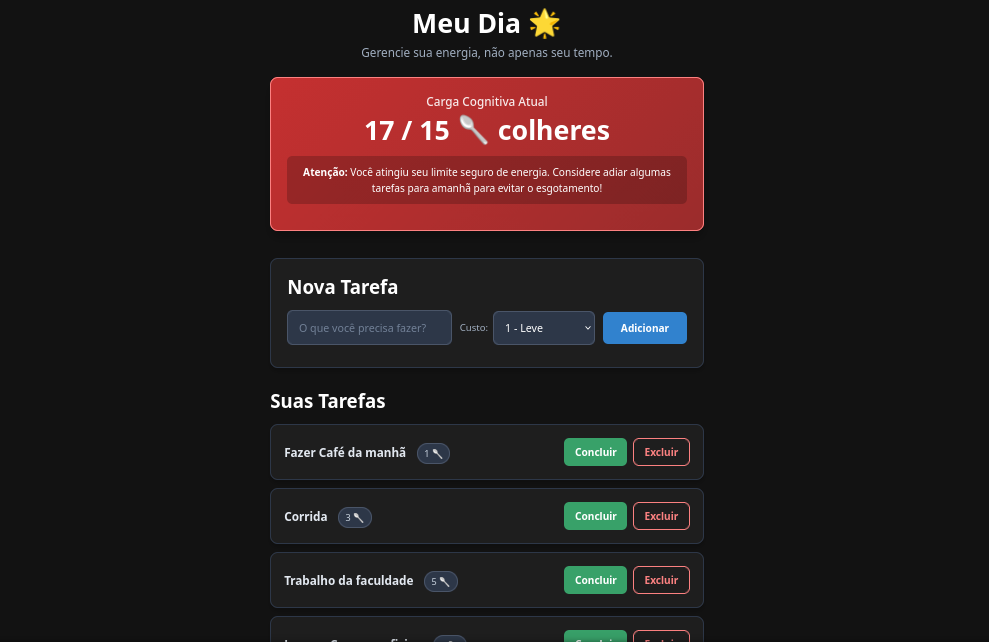
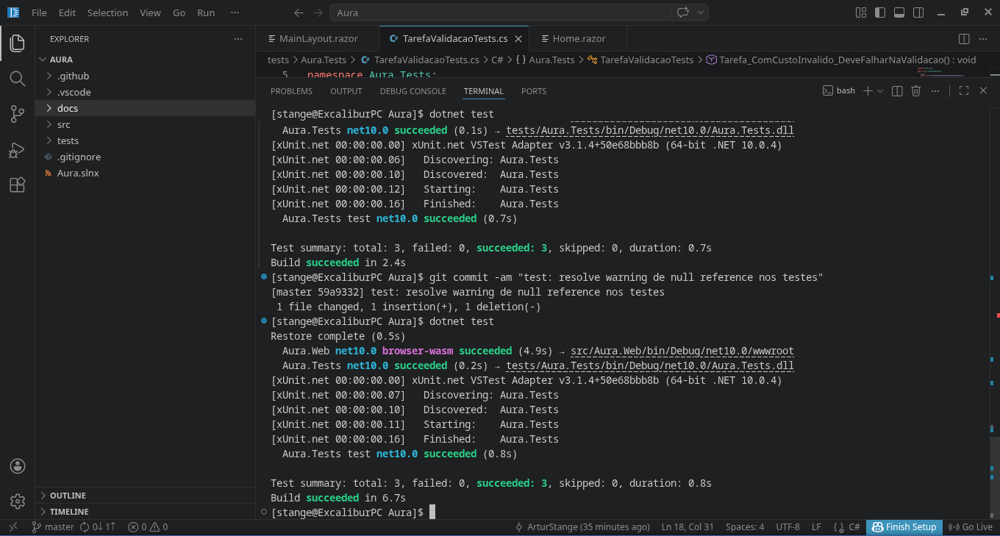

# Aura - Gestão de Rotina e Energia 🌟

[](https://github.com/SEU-USUARIO/Aura/actions)

🌍 **Link da Aplicação Publicada (Deploy):** [Clique aqui para acessar](https://seuprojeto.azurewebsites.net)

## 📌 Problema Real
A maioria das ferramentas de produtividade e listas de tarefas do mercado foca na gestão de *tempo*. Para pessoas neurodivergentes (como indivíduos com TDAH ou no espectro autista) e pessoas com fadiga crônica, o maior desafio não é o tempo, mas a **carga cognitiva e a energia mental**. Aplicativos complexos com excesso de menus, cores e urgências causam sobrecarga visual e paralisia executiva, piorando a rotina ao invés de ajudar.

## 💡 A Solução
O **Aura** é um gerenciador de tarefas diárias extremamente minimalista baseado na "Teoria das Colheres" (Spoon Theory). Em vez de focar em prazos, o usuário cadastra tarefas atribuindo a elas um **Custo de Energia** (de 1 a 5). O sistema soma a energia gasta no dia e avisa gentilmente quando o usuário está prestes a atingir o esgotamento (burnout), sugerindo que ele adie tarefas não essenciais. 

## 🎯 Público-Alvo
* Pessoas com Transtorno do Déficit de Atenção com Hiperatividade (TDAH).
* Indivíduos no Transtorno do Espectro Autista (TEA).
* Pessoas com condições de fadiga crônica.
* Qualquer indivíduo que sofra com ansiedade ao usar gerenciadores de tarefas tradicionais.

## ⚙️ Funcionalidades Principais
* **Cadastro Simples de Tarefas:** Adição de atividades com título e Custo de Energia.
* **Dashboard de Carga Cognitiva:** Visualização da energia gasta no dia para evitar o esgotamento.
* **Interface de Alto Contraste e Baixa Fricção:** Design focado em acessibilidade e redução de ruído visual.
* **Armazenamento Local:** Os dados ficam salvos diretamente no navegador (LocalStorage), garantindo privacidade e velocidade.

## 🛠️ Tecnologias Utilizadas e Dependências
* **Frontend/Backend:** C# e .NET 10 (Blazor WebAssembly)
* **Estilização:** HTML5 e CSS3 puros
* **Persistência de Dados:** Blazored.LocalStorage
* **Testes Automatizados:** xUnit
* **Linting / Análise Estática:** .NET CLI (`dotnet format`)
* **CI/CD:** GitHub Actions

*As dependências exatas estão formalmente declaradas no arquivo de manifesto `src/Aura.Web/Aura.Web.csproj`.*

## 🚀 Instruções de Instalação e Execução

**Pré-requisito:** [.NET 10 SDK](https://dotnet.microsoft.com/download/dotnet/10.0) instalado.

1. Clone este repositório para a sua máquina:
   ```bash
   git clone [https://github.com/SEU-USUARIO/Aura.git](https://github.com/SEU-USUARIO/Aura.git)
   cd Aura
2. Restaure as dependências do projeto:
   ```bash
   dotnet restore
3. Execute o projeto GUI (Blazor WebAssembly):
   ```bash
   dotnet run --project src/Aura.Web
4.Abra o navegador no endereço indicado no terminal (ex: http://localhost:5000).

## 🧪 Instruções para Testes e Linting

O projeto conta com uma suíte de testes automatizados para garantir a estabilidade da regra de negócio de cálculo de energia e validações de limites (Entradas válidas e inválidas).

Para rodar os testes automatizados:
    
    dotnet test

Para rodar a ferramenta de qualidade estática (Linting):
Esta ferramenta verifica se a formatação e a estrutura do código estão nos padrões profissionais exigidos.

    dotnet format --verify-no-changes

## Como executar localmente
1. Faça o clone do repositório.
2. Rode `dotnet restore` e `dotnet build`.
3. Rode `dotnet run`.
4. Acesse `http://localhost:5000`.

## 🏷️ Versionamento Semântico

Este projeto utiliza o padrão SemVer.
Versão Atual: 1.0.0 (Conforme declarado explicitamente no arquivo .csproj).

## 👨‍💻 Autor e Repositório
Autor: Artur Stange Félix.
Repositório Público: https://github.com/ArturStange/Aura

## 📸 Evidências de Funcionamento

Abaixo estão as capturas de tela demonstrando a aplicação em funcionamento (Dark Mode) e o alerta de carga cognitiva:

- **Tela Inicial (Sistema Saudável):**
  

- **Alerta de Sobrecarga (Burnout):**
  

- **Execução dos Testes Automatizados:**
  
